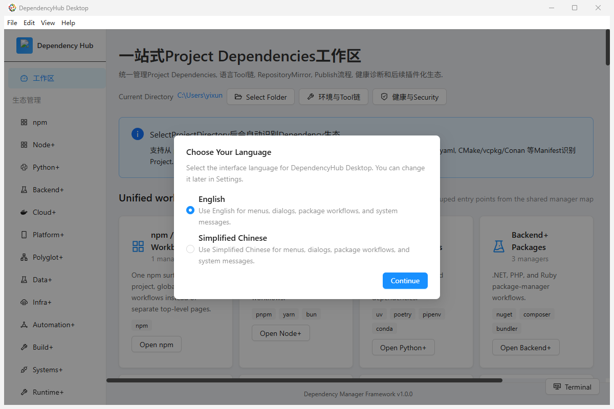

# DependencyHub Desktop

<div align="center">

**面向多生态项目的桌面依赖管理与工程治理平台**

把项目依赖、工具链、搜索、健康检查、安全审计、发布准备和扩展管理放在一个跨平台 Electron 工作区中。

[](https://github.com/yixunfei/dependencyhub-desktop/releases)
[](LICENSE)
[](https://www.electronjs.org/)
[](https://react.dev/)
[](https://www.typescriptlang.org/)

[English](#english) · [简体中文](#简体中文)

</div>

> 当前版本：**1.0.3**（Windows 安装版与便携版可在 [GitHub Releases](https://github.com/yixunfei/dependencyhub-desktop/releases) 下载）。

## 简体中文

### 项目定位

DependencyHub Desktop 已从最初的 npm 依赖小工具升级为**项目依赖管理平台**。它以项目目录为上下文，检测项目使用的清单和锁文件，再通过统一工作区呈现不同生态的依赖、工具链、注册表和发布动作。你可以在同一界面中处理 Node.js、Python、JVM、Rust、Go、Flutter 与 C/C++ 项目，也可以使用扩展管理器查看后续生态的覆盖路线。

平台强调三个原则：

1. **上下文一致**：项目级依赖、环境级工具链和发布级凭据分层管理，减少在多个终端间切换时的误操作。
2. **证据可追溯**：命令输出、审计结果、变更记录、锁文件漂移和发布检查都可以在工作区中留痕。
3. **能力可扩展**：管理器定义、检测规则和插件组件通过共享注册表组织，新增生态时不需要复制整套页面逻辑。

### 已实现能力

#### 依赖与项目工作区

- 自动检测 `package.json`、`requirements.txt`、`pyproject.toml`、`pom.xml`、`Cargo.toml`、`go.mod`、`pubspec.yaml`、`CMakeLists.txt` 等项目入口。
- 项目依赖和全局依赖分开管理；切换项目目录后自动刷新清单、锁文件和命令上下文。
- 安装、卸载、升级、批量升级、版本切换，并在执行前显示版本变更预览。
- 依赖列表、依赖树、依赖数量和包体积可视化；支持过滤、分页和详情弹窗。
- 项目脚本/任务运行、集成终端、命令历史和可展开的命令日志。

#### 已支持的管理器

| 生态 | 管理器 | 典型清单/锁文件 | 重点能力 |
| --- | --- | --- | --- |
| Node.js | npm | `package.json` / `package-lock.json` | 搜索、依赖管理、脚本、`npm audit`、发布 |
| Python | pip | `requirements.txt` / `pyproject.toml` | 环境包管理、`pip check`、`pip-audit`、发布 |
| JVM | Maven | `pom.xml` / `settings.xml` | 依赖树、版本切换、离线准备、OWASP 检查、部署 |
| JVM / Android | Gradle | `build.gradle(.kts)` / `gradle.lockfile` | task、dependency insight、锁文件审查 |
| Rust | Cargo | `Cargo.toml` / `Cargo.lock` | crates.io 搜索、依赖树、`cargo audit` |
| Go | Go Modules | `go.mod` / `go.sum` | 模块增删改、`go mod tidy`、`govulncheck` |
| Dart | Flutter pub | `pubspec.yaml` / `pubspec.lock` | `pub outdated`、依赖树、OSV 审计、发布前检查 |
| C / C++ | CMake / vcpkg / Conan | `CMakeLists.txt`、`vcpkg.json`、`conanfile.*` | 原生库搜索、构建任务、工具链与锁文件 |

#### AI 依赖（MCP / Skills / Agents）

AI 工具链本身也是依赖面：MCP 服务器、Agent Skills 和 Agent 指令文件都会影响运行时的行为与权限，因此和包管理器一样需要清单、锁证据和漂移检查。本页把它们作为一等生态接入：

| 生态 | 管理器 | 清单/配置 | 锁证据 | 重点能力 |
| --- | --- | --- | --- | --- |
| MCP | MCP Servers | `.mcp.json`、`mcp.json`、`.cursor/mcp.json`、`.vscode/mcp.json`、`.workbuddy-ai/mcp.json`、`claude_desktop_config.json` | `mcp-lock.json` | 服务器清单、传输方式、版本固定、明文凭据与 HTTP 端点检查、声明增删 |
| Agent Skills | Skills | `skills.json` 声明 + 任意位置的 `SKILL.md` | `skills.lock.json` | frontmatter 校验、描述长度、脚本与 allowed-tools 一致性、重名与来源漂移 |
| Agent 指令 | Agents | `agents.json` 声明 + `AGENTS.md`、`CLAUDE.md`、`.cursor/rules/*.mdc`、`.github/copilot-instructions.md` 等 | `agents.lock.json` | 指令/规则/子代理清单、空文件与缺失 frontmatter、工具权限声明、锁漂移 |

- 操作集为 `sync`、`install`、`remove`、`audit`、`tree`、`list`、`lock`。这些生态没有统一的包管理器 CLI，因此操作由 DependencyHub 本地引擎执行：只读操作重新扫描工程并输出清单或审计结果，写操作以原子写入修改清单/锁文件，并先生成可恢复的备份；不支持任意自定义命令，避免伪装成外部 CLI 成功。
- 健康检查会报告未固定版本、`http://` 远程端点、配置中的明文凭据、重复/冲突声明、声明与本地文件不一致、锁证据缺失或漂移。
- 锁文件由 DependencyHub 管理（记录来源、版本与内容哈希），可提交到仓库用于复现；`npm run verify:ai-managers` 覆盖清单解析、计划、锁写入、dry-run 不写、增删变更、失败回滚与恢复。
- 与既有治理链路打通：AI 组件会出现在 SBOM（CycloneDX / SPDX）中，并带上 `pkg:generic/mcp-server|agent-skill|agent-instruction` 形式的 package URL；工作区发现会检测 `.mcp.json`、`skills/*`、`AGENTS.md` 等标记（仅含 AI 清单的目录会被识别为 `ai-project`，同时存在语言清单时保留其原有生态类型）；锁文件漂移报告会对「已声明但缺少锁证据」的 AI 生态给出 warning 级发现。

#### 搜索、发布与供应链

- 聚合 npm、PyPI、Maven Central、crates.io、Go/GitHub 模块和 pub.dev 元数据，展示版本、README/变更日志、下载量、依赖者和包大小。
- 发布管理器提供清单校验、发布标签、访问权限、Registry 选择和 readiness gate；发布凭据通过安全桥接层传递，不写入 README、日志或 Release 资产。
- 健康中心统一呈现依赖健康、锁文件漂移、过期包、Registry 可达性和工具链状态。
- 适配 `npm audit`、`pip-audit`、`cargo audit`、`govulncheck`、OWASP dependency-check 与 OSV 查询。
- 供应链策略包含许可证、包/管理器黑名单、版本固定、浮动 CI/容器引用、SBOM/报告索引，以及 CI 记录、审批、异常、回滚快照、完整性/签名/来源证明。

#### 工具链与体验

- 全局与项目级 Node、Python、Maven、Cargo、Gradle、Go、Flutter、CMake/vcpkg/Conan 路径配置。
- Windows、macOS、Linux 菜单和界面本地化；简体中文/English 切换；深色/浅色主题。
- Electron 主进程负责文件、进程和凭据边界，React 渲染层只通过 preload 暴露的最小 API 访问系统能力。

### 预览能力与扩展路线

pnpm、Yarn、Bun、uv、Poetry、Pipenv、Conda、NuGet、Composer 与 Bundler 已进入 `preview`。Node 组提供工作区/锁文件库存与 npm Registry 搜索；Python 和后端组提供结构化清单及传递依赖解析、PyPI/Anaconda/NuGet/Packagist/RubyGems 搜索、专项健康检查、操作计划、可用时的原生命令 dry-run，以及变更前备份和恢复。AI 组（MCP / Skills / Agents）同样为 `preview`，提供清单解析、健康检查、本地锁证据与可回滚的声明变更。共享注册表仍预留 Deno、Docker、Helm、Terraform、Ansible、GitHub Actions、Bazel、Homebrew、Scoop、winget 等入口；`planned` 仅表示检测模型和页面骨架已预留，不代表完整读写能力。

### 界面演示

以下截图来自项目实际运行界面，分别展示项目依赖、依赖树、发布检查和 Registry 配置；本地路径和凭据字段已脱敏。



*DependencyHub Desktop 1.0.2：首次启动语言选择与多生态统一工作区。*


*项目依赖列表：批量安装、更新、审计和依赖树入口集中在同一工作区。*


*依赖树：同时查看直接依赖与完整传递依赖，并支持搜索和展开/折叠。*


*发布检查：在执行发布前确认清单、版本、许可证和 Registry 配置。*


*Registry 配置：管理镜像源、缓存目录、全局前缀和用户配置。*

### 性能与工作流对比

性能收益主要来自一次检测、复用上下文和按需加载页面，而不是替换底层包管理器。安装/解析速度仍由底层 CLI、网络和本地缓存决定。

| 场景 | DependencyHub Desktop | 传统分散式 CLI 流程 |
| --- | --- | --- |
| 依赖盘点 | 自动检测清单/锁文件，列表和树视图共享结果 | 分别运行 `npm ls`、`pip list`、`mvn dependency:tree` 后手工拼接 |
| 批量升级 | 统一选择、版本预览、执行和日志回看 | 每个生态使用不同命令或脚本，升级前后人工核对 |
| 安全审计 | 健康中心聚合审计、漂移、Registry 和许可证信号 | 各生态分别执行审计工具，再整理报告 |
| 工具链切换 | 全局/项目路径集中管理，命令运行器复用解析结果 | 依赖 shell 配置、PATH 和项目脚本，容易环境不一致 |
| 发布准备 | 清单校验、readiness gate、审批和证据索引集中呈现 | 发布者自行维护检查清单和终端输出 |

#### 可复现的本地基准

不要把跨机器不可复现的数字写成宣传结论，请在相同 Node.js、磁盘、网络和缓存条件下采集自己的基准：

```powershell
Measure-Command { npm run build }
Get-ChildItem dist -Recurse -File | Measure-Object -Property Length -Sum
npm ls --all --json > $env:TEMP\dependencyhub-desktop-deps.json
```

对比“CLI 命令串行执行”和“平台一次检测/批量操作”的总耗时；不要把单个包管理器的下载速度当作平台性能。构建产物和 Release 页面会提供版本、架构与 SHA-256，便于复核。

### 快速开始

#### 直接使用发布包

1. 打开 [Releases](https://github.com/yixunfei/dependencyhub-desktop/releases)。
2. Windows 选择 `DependencyHub.Desktop.Setup.<version>.exe`（安装版）或 `DependencyHub.Desktop.<version>.exe`（便携版）。GitHub Release 会将文件名中的空格规范化为点号。
3. 首次启动后选择项目目录，平台会显示检测到的管理器。

macOS 可使用 `.dmg` / `.zip`，Linux 可使用 `.AppImage` / `.deb` / `.rpm`（具体资产取决于发布版本）。

#### 从源码运行

要求 Node.js 22.12+、npm 10+、Git，以及目标生态的 CLI（Python/pip、JDK/Maven、Rust/Cargo、Go、Flutter、CMake/vcpkg/Conan 等）。

```bash
git clone https://github.com/yixunfei/dependencyhub-desktop.git
cd dependencyhub-desktop
npm install
npm run dev
```

构建当前平台安装包和便携包：`npm run dist`。按平台构建：

```bash
npm run build:win-installer
npm run build:win-portable
npm run build:mac-dmg
npm run build:mac-zip
npm run build:linux-appimage
npm run build:linux-deb
```

跨平台构建受操作系统和签名工具限制；构建输出位于 `release/`，该目录默认被 `.gitignore` 排除，不会混入源代码提交。

### 验证与故障排查

```bash
npm run build
npm test
npm run verify:ipc
npm run verify:engineering-debt
npm run verify:framework
npm run verify:ai-managers
npm run verify:i18n
npm run verify:release-integrity
npm run verify:release-signature
npm run verify:release-trust
```

- 工具不可用时，在“工具链/Tool Versions”中配置项目级路径。
- 审计工具是可选依赖；缺失时界面显示安装建议，不会伪造审计结果。
- Maven/Gradle 远程搜索速度取决于 Maven Central、镜像和本地 `.m2` 规模。
- Windows 终端乱码时，优先将相关 CLI 和终端编码设置为 UTF-8。
- 发布失败时先查看命令日志和 readiness gate，再决定是否手动覆盖。

### 项目结构

```text
dependencyhub-desktop/
├─ electron/                 # 主进程、preload 与生态服务
├─ shared/                   # 共享管理器注册表和领域类型
├─ src/domain/               # 领域模型、能力与策略
├─ src/features/             # 工作区、管理器、健康中心、搜索和设置
├─ src/components/           # 可复用 UI 组件
├─ src/stores/               # Zustand 状态模块
├─ scripts/                  # 构建、发布、完整性和框架验证
├─ build/                    # electron-builder/NSIS 资源
├─ image*.png                # README 演示截图
├─ LICENSE                   # MIT 许可证
└─ package.json              # 开发、构建和发布入口
```

### 贡献与许可证

欢迎提交 Issue 和 Pull Request。请先阅读 [CONTRIBUTING.md](CONTRIBUTING.md)，并在提交前运行 `npm run build` 与相关验证脚本。新增管理器时，优先扩展共享注册表和独立 service，保持 UI 与底层命令解耦。

本项目使用 [MIT License](LICENSE) 开源；第三方依赖仍受其各自许可证约束。

---

## English

### What it is

DependencyHub Desktop is a cross-platform Electron workspace for project dependency management and engineering governance. It started as an npm desktop helper and now provides one context for Node.js, Python, JVM, Rust, Go, Flutter, and C/C++ projects. The app detects manifests and lockfiles, separates project/global/publish scopes, and exposes package operations, toolchain configuration, health checks, security audits, release readiness, and plugin-oriented extensions.

### Implemented today

- **Eight built-in managers**: npm, pip, Maven, Gradle, Cargo, Go Modules, Flutter pub, and C/C++ (CMake/vcpkg/Conan).
- **Project workspace**: manifest/lockfile detection, dependency tables and trees, version previews, batch updates, project scripts/tasks, terminal and command history.
- **Search**: npm, PyPI, Maven Central, crates.io, Go/GitHub modules, and pub.dev metadata.
- **Security and health**: npm audit, pip-audit, cargo-audit, govulncheck, OWASP dependency-check, OSV, lockfile drift, registry reachability, license and supply-chain policies.
- **Release governance**: package validation, readiness gates, CI evidence, approvals, exceptions, rollback snapshots, integrity/signature/provenance reports.
- **Toolchains and UX**: project/global executable paths, English/Simplified Chinese localization, dark/light themes, lazy-loaded routes, and a secure Electron preload boundary.
- **AI dependency workspace**: MCP servers (`.mcp.json`, `mcp.json`, `.cursor/mcp.json`, `.vscode/mcp.json`, `.workbuddy-ai/mcp.json`, `claude_desktop_config.json`), Agent Skills (`SKILL.md` + `skills.json`), and agent instructions/rules (`AGENTS.md`, `CLAUDE.md`, `.cursor/rules/*.mdc`, `.github/copilot-instructions.md`, `agents.json`) with pinning, transport and plaintext-credential findings, duplicate/declaration drift, and DependencyHub-managed lock evidence (`mcp-lock.json`, `skills.lock.json`, `agents.lock.json`). Because these ecosystems have no package-manager CLI, operations run in a local engine: read-only operations re-scan the project, mutations rewrite the manifest or lock file atomically behind a restorable backup, and arbitrary shell commands are refused instead of faked. AI entries also flow into the existing governance chains: they appear in CycloneDX/SPDX exports with `pkg:generic/mcp-server|agent-skill|agent-instruction` package URLs, workspace discovery recognises AI markers (an AI-only manifest directory is reported as `ai-project`, while a directory that also ships a language manifest keeps that ecosystem as its primary kind), and the lockfile drift report raises warning-level findings for AI ecosystems that declare inputs without lock evidence.

pnpm, Yarn, Bun, uv, Poetry, Pipenv, Conda, NuGet, Composer, and Bundler are available as preview adapters. Node managers provide workspace/lockfile inventory and npm Registry search. Python and backend managers add structured manifest and transitive lock parsing, PyPI/Anaconda/NuGet/Packagist/RubyGems search, manager-specific health diagnostics, operation plans, native dry-runs where supported, and manifest backup/restore. The AI managers (MCP, Skills, Agents) are preview adapters with the same inventory, health, lock evidence, and reversible declaration mutations. Deno, Docker, Helm, Terraform, Ansible, CI managers, Bazel, Homebrew, Scoop, winget, and other entries remain planned roadmap metadata rather than a claim of full read/write support.

### Screenshots


### Performance notes

The application improves workflow latency by detecting a project once, reusing manager context, and lazy-loading feature pages. Package resolution and download speed still come from the underlying ecosystem tool, network, and cache. Use the reproducible commands above to collect build, artifact-size, and dependency-count baselines; the table is a workflow comparison, not a synthetic claim that every ecosystem is faster.

### Quick start

Download the latest installer or portable artifact from [GitHub Releases](https://github.com/yixunfei/dependencyhub-desktop/releases). For source development:

```bash
git clone https://github.com/yixunfei/dependencyhub-desktop.git
cd dependencyhub-desktop
npm install
npm run dev
```

Build the current platform with `npm run dist`. Run `npm run build` and the `verify:*` scripts before opening a pull request. See [CONTRIBUTING.md](CONTRIBUTING.md) and [LICENSE](LICENSE).
